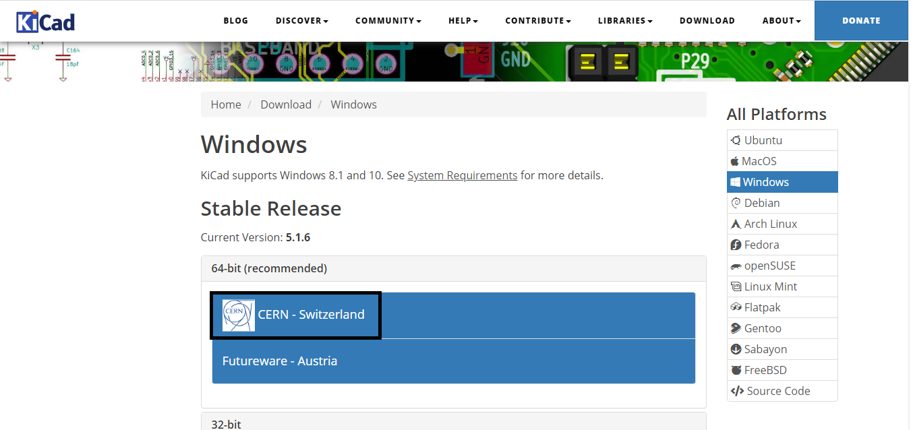
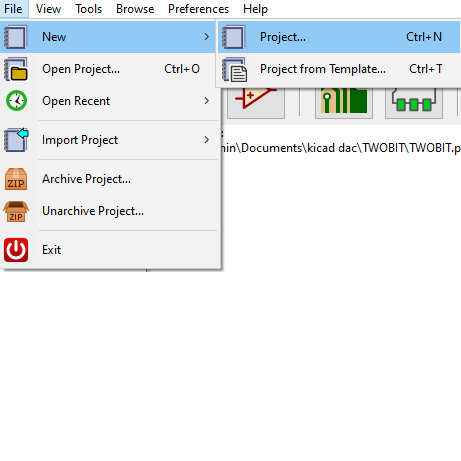
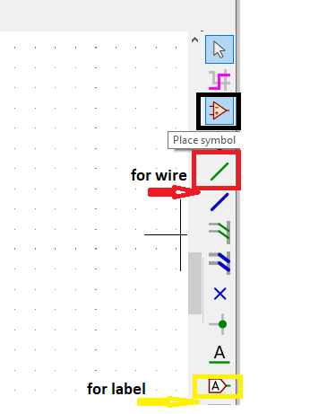
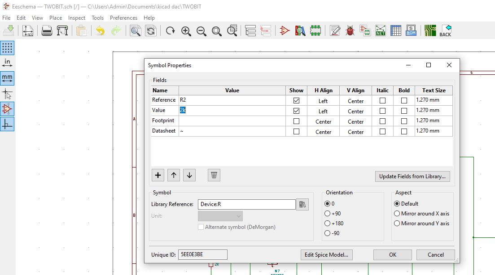
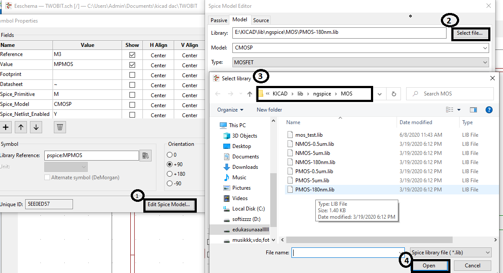
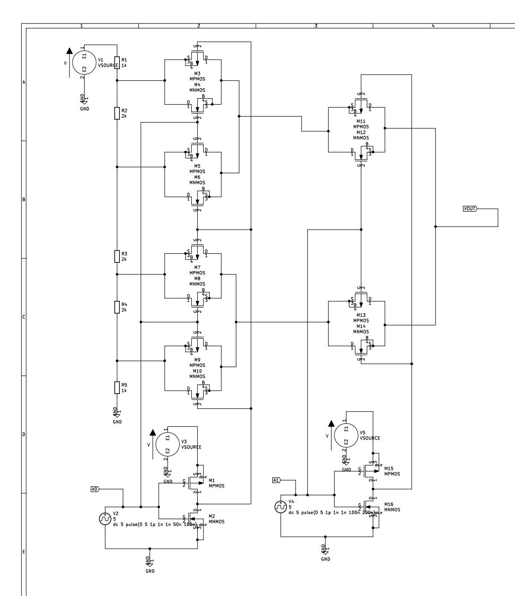
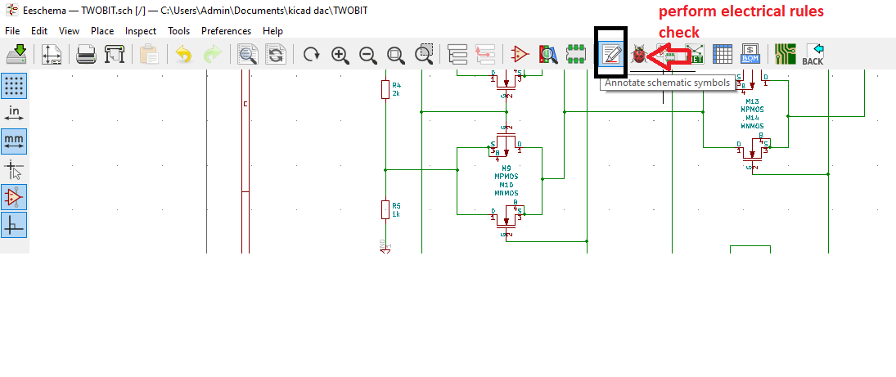
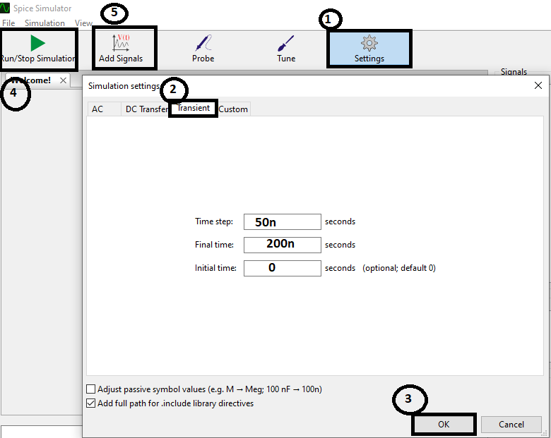
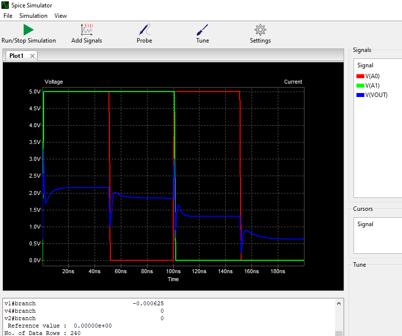
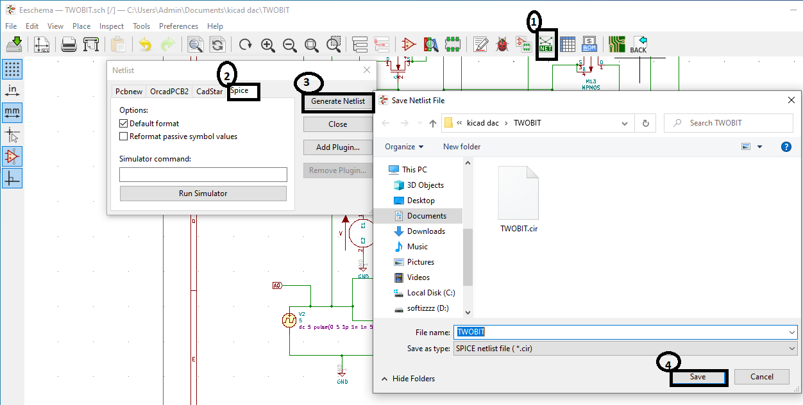

Aim of project: Design of 10bit potentiometric DAC 3.3v analog voltage, 1.8v digital voltage and 1 off-chip external voltage reference@osu180nm

 **Design of PDAC**
 
 
Most of the real-world applications deal with analog and digital signal, therefore conversion from digital to analog signal and vice-versa are required to achieve a respective task in an specific application. To carryout such process of conversion digital-to-analog convertor (DAC’s) and analogto-digital converter (ADCs) are required. However, This Project  focuses on designing of potentiometric DAC(Digital to Analog Converter) where digital binary is given as a input and coressponding analog voltage is obtained.In this project Resistor String DAC (RDAC) topology is used which allows to divide the voltage using resistor-string architecture.Here two bit PDAC is implemented in 180nm CMOS Technology node.Repository consist of all schematic,netlist spice code,output waveform etc.

 **Set Up For Simulation**
 
 
KiCad is open source tool (GPL) integrated package which helps to draw a schematic and obtained pcb layout.For simulation of this project firstly install  KiCad for windows,mac Os etc. according to device.
Simulation steps of KiCad on windows are as follows.

1.Install  KiCad from given link  On Windows, and other Linux distributions: https://www.kicad-pcb.org/ and download and install KiCad.

2.Select CERN Switzerland 

3.Run " kicad.exe and proceed by basic intallation process,hence  a main window will pop up.

4.Create a new project:“File” -> “New”->  “New Folder” button, and name the new folder.

5.. Open the new folder by double clicking on it and Enter the name of the project in “File name”.  Now click on open a kicad window will open.

6.Click on the Schematic editor button a  “EESchema” window opens here draw the schematic by  clicking on the “place a components” button found in the right toolbar and make connection by selecting wire from right toolbar.

7. Enter the values of the component Right click in the middle of the component and select “Edit Component” -> “Value” OR press "E" from the keyboard.

8. For MOSFETs go to" edit spice model-->select library of 180nm having extension of .lib.

9. Once schematic is done ,save the schematic project: by clicking on the “File” -> “Save Whole Schematic Project" from left corner of the tool baar.

10.The components now need to be given unique identifiers. To do this click on the
“Annotate schematic” -->“Use the current page only” -->“Annotation"-->"OK"

11.Click on the “Schematic Electric Rules Check” -->"Run",  check the warning and errors. and correct the errors if found.Again save schemetic as mentioned in step no. 9.

12.Now for simulating the schematic click on" Tools"-->"Simulator"-->"setting"-->"transient analysis"(enter time step=50ns,final time=200ns and initial time=0)-->"OK"-->" Run/simulate"--> Add signal"(Select input bits V(A0),V(A1) and output voltage v(OUT) , observe the Staircase analog output waveforms.

13.The analog output waveform is obtained for Twobit potentiometric DAC as shown below.

**STEPS FOR GENERATION OF NETLIST**

1.	Click on “Netlist generation” on the top toolbar.
2.	Select spicemark on default format.Save the file with default file name.

3.	To observe the netlist spice code go to the main window of kicad here you can see at the left corner a new file will be generated with .cir extension.
4.	Now to open the Netlist spice code go to the folder where you have created your project
,there you can observe .cir file ,copy that file and paste it in the same folder ,rename it with .asm or else any editor format to open the file in wordpad or in notepad etc.
For further information regarding kicad you can visit to the user manual of kicad ,link is given below https://learn.sparkfun.com/tutorials/beginners-guide-to-kicad/all OR https://frgmnt.org/w/wp-content/uploads/2011/05/KiCad_Tutorial-2011.pdf

**What is Ngspice?**
Ngspice is the open source spice simulator electronic circuits. It is SPICE compatible. You may apply PSPICE or LTSPICE device model parameters and netlists for schematics . ngspice will also read HSPICE device libraries from semiconductor foundry PDKs for simulating integrated circuits and generates simulation plots of corresponding netlist.

**STEPS FOR SIMULATION OF SPICE NETLIST**

The  netlist of the PDAC is generated as mention in the above step,the netlist spice code is the input to the ngspice telling it about circuit to be simulated,with some simulation commands ngspice starts  the simulation and plots the output graphs.

*INSTALLATION OF NGSPICE FOR UBUNTU:*
   
    Installing ngspice package on Ubuntu 16.04 (Xenial Xerus) is as easy as running the following  command on terminal:
sudo apt-get update
sudo apt-get install ngspice

*STEPS*

1.	Download the TWOBIT.cir.out  file from the repositary and set directory to save the file.

2.	Open the ngspice

3.	To simulate type ngspice 1->TWOBIT.cir.out ,hence the simulated analog voltage waveform as shown below where V(a0) & V(a1) are the inputs bits waveform and V(vout) is analog voltage waveform.

**Contact Information**

Neelam B. Chaurasiya,BE-Degree, VESIT Mumbai, chaurasiyaneelam001@gmail.com

KUNAL GHOSH, Director, VSD Corp. Pvt. Ltd. kunalpghosh@gmail.com

PHILIPP GÜHRING, Software Architect at LibreSilicon Association pg@futureware.at

Dr. GAURAV TRIVEDI, Co-Principal Investigator, EICT Academy, IIT Guwahati trivedi@iitg.ac.in
