Aim of project: Design of 10bit potentiometric DAC 3.3v analog voltage, 1.8v digital voltage and 1 off-chip external voltage reference@osu180nm

 **Design of PDAC**
 
 
Most of the real-world applications deal with analog and digital signal, therefore conversion from digital to analog signal and vice-versa are required to achieve a respective task in an specific application. To carryout such process of conversion digital-to-analog convertor (DAC’s) and analogto-digital converter (ADCs) are required. However, This Project  focuses on designing of potentiometric DAC(Digital to Analog Converter) where digital binary is given as a input and coressponding analog voltage is obtained.In this project Resistor String DAC (RDAC) topology is used which allows to divide the voltage using resistor-string architecture.Here two bit PDAC is implemented in 180nm CMOS Technology node.Repository consist of all schematic,netlist spice code,output waveform etc.

 **Set Up For Simulation**
 
 
 LTSPICE is the free circuit simulation package from Linear Technology Corporation (LTC). It is extremely easy to learn also used for the simulation analog components as well as passive componenets.In this models from manufacturers can also be imported.
** NOTE: LTspice IV is no longer updated. Please use LTspice XVII**

**INSTALLATION STEPS OF LTspiceXVII for windows 10**

1.	Click on the link to install LTspiceXVII https://www.analog.com/en/design-center/design-tools-and-calculators/ltspice-simulator.html# and proceed with basic installation steps.

2.	Once done with the simulation,Open LTspiceXVII and start the design of 10bit potentiometric DAC.

*3.	The designing steps are explained below:*

(i)	Click on 'New Schematic' for making schematic and for symbol click on to the ‘New symbol’.

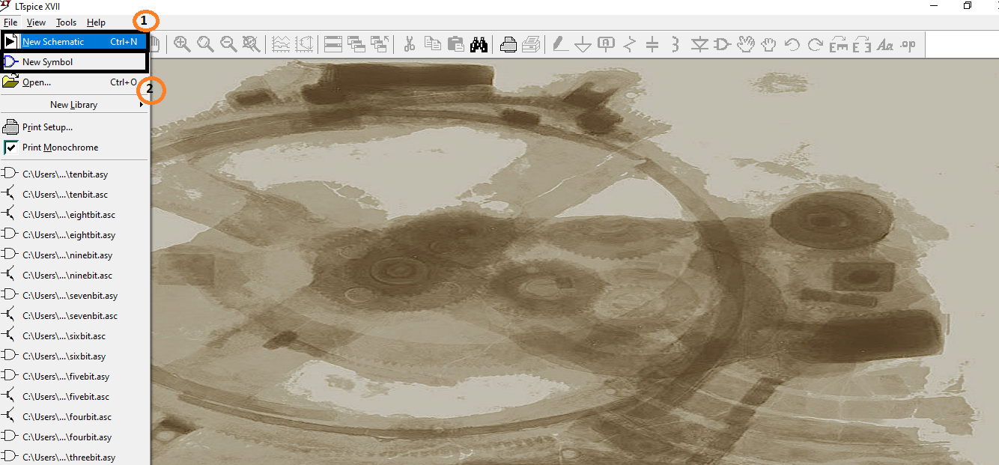

(ii)	 Before making schematic add osu180nm library file in your directry path,to print on to the schematic click on ‘.op’ as clearly mentioned in below image,make a use of different components for designing and save it.

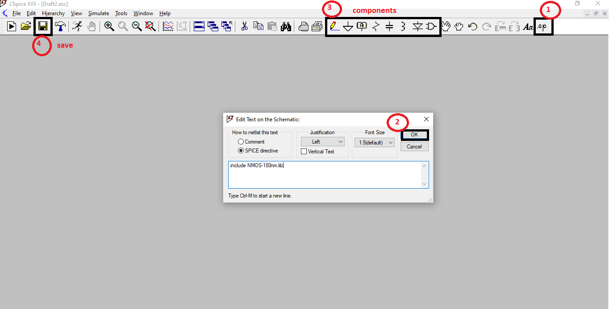

(iii)	Below figure represents schematic of switch and its symbol

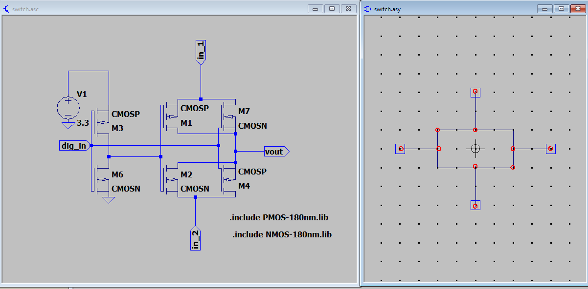

(iv)	Below figure represents schematic of 2bit and its symbol,here symbols of switch is used for implementation of 2bit.

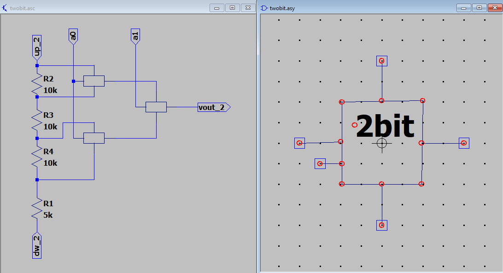

(v)	Below figure represents schematic of 3bit and its symbol,here symbols of 2bit is used for implementation of 3bit.

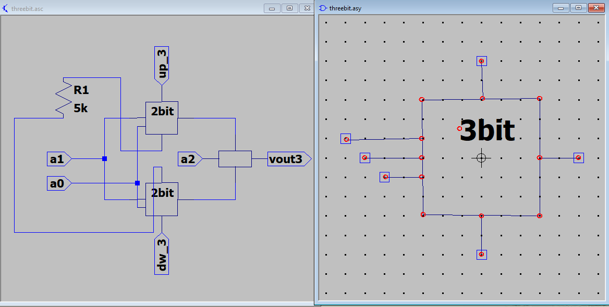

(vi)	Below figure represents schematic of 4bit and its symbol,here symbols of 3bit is used for implementation of 4bit.

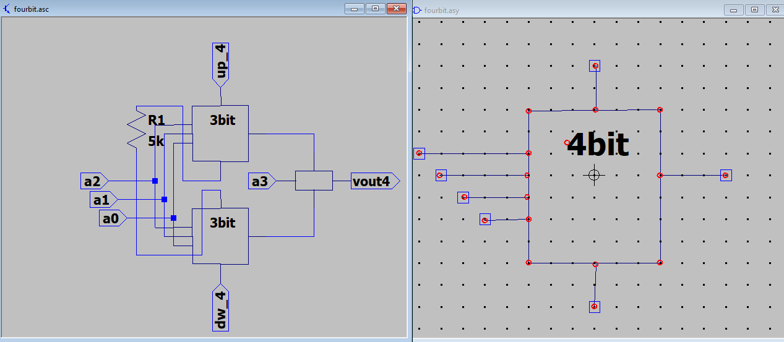

(vii)	Below figure represents schematic of 5bit and its symbol,here symbols of 4bit is used for implementation of 5bit.

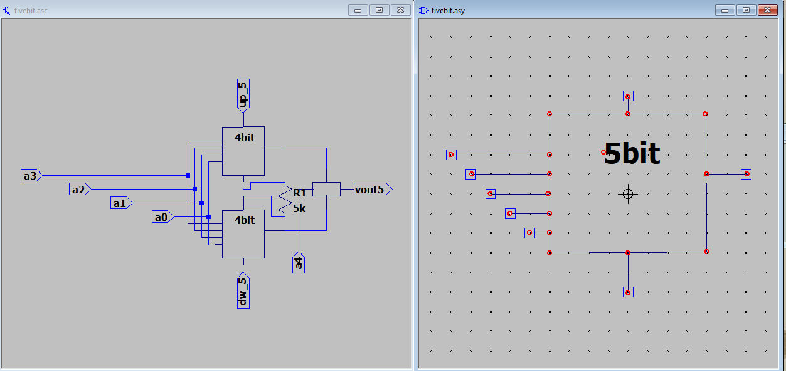

(viii)	Below figure represents schematic of 6bit and its symbol,here symbols of 5bit is used for implementation of 6bit.

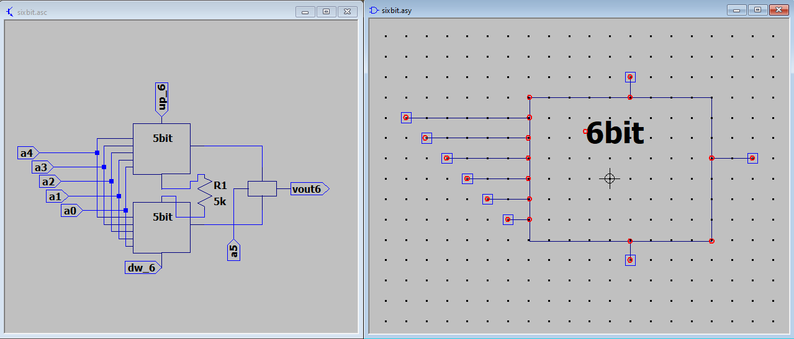

(ix)	Below figure represents schematic of 7bit and its symbol,here symbols of 6bit is used for implementation of 7bit.

(x)	Below figure represents schematic of 8bit and its symbol,here symbols of 7bit is used for implementation of 8bit.

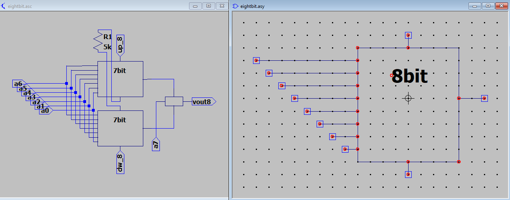

(xi)	Below figure represents schematic of 9bit and its symbol,here symbols of 8bit is used for implementation of 9bit.

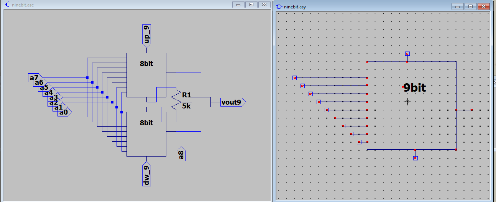

(xii)	Below figure represents schematic of 10bit and its symbol,here symbols of 9bit is used for implementation of 10bit.Here finally we are done with 10bit potentiometric DAC.

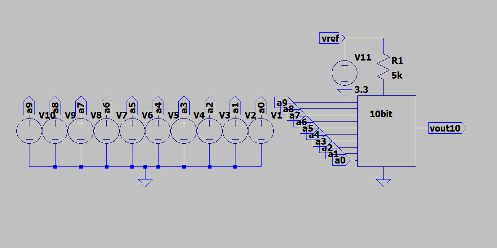

(xiii)	Click on “run” for proceeding for the simulation(refer below image).

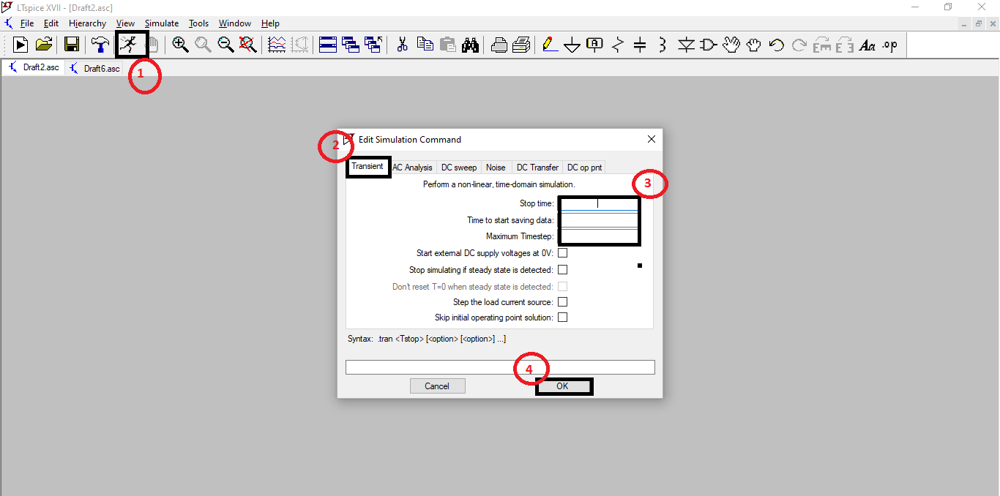

(xiv)	To get the output voltage click on “plot setting-->add trace to plot-->v(vout10)[selecting output reference node]-->OK”.

In the below figure analog output voltage is obtained for the binary “1111111111”.

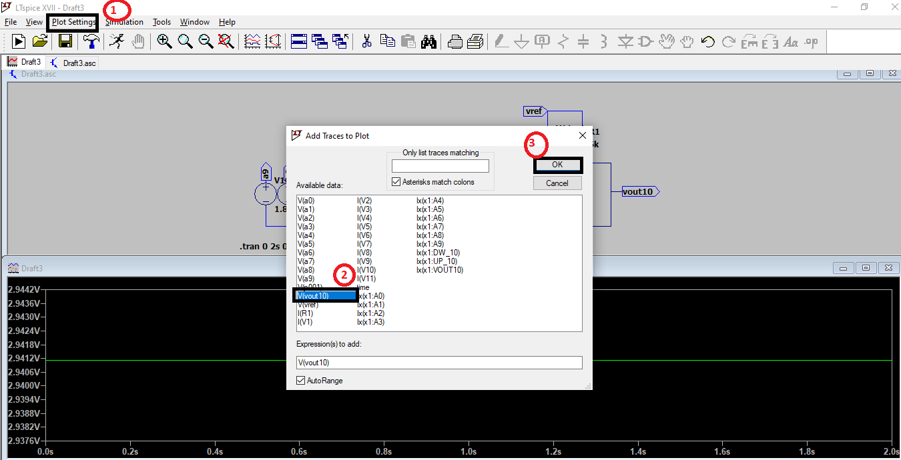

(xv) For generating NETLIST SPICE CODE click on " view-->SPICE Netlist" ,copy the netlist spice code and paste it into notepad ,save it by .cir extension

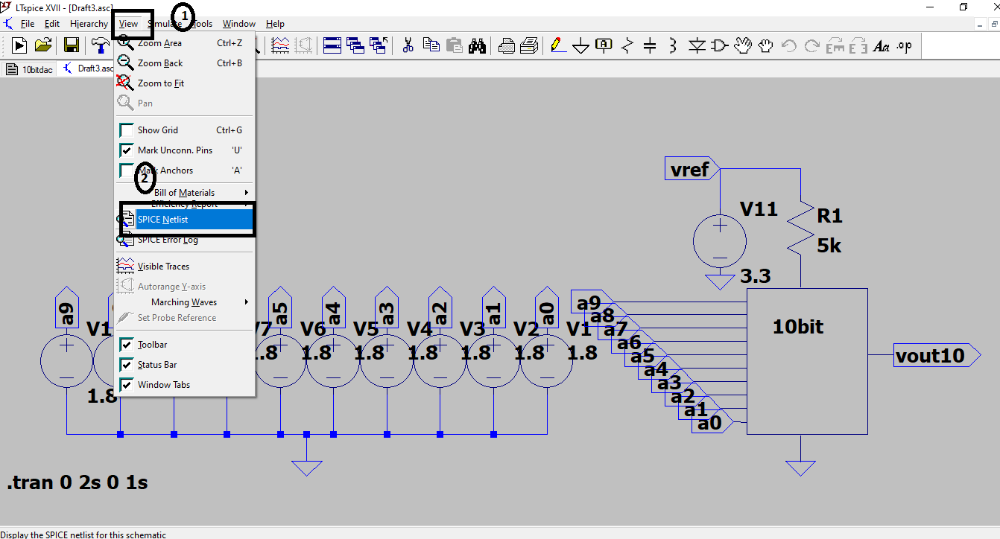

**STEPS FOR SIMULATION OF SPICE NETLIST**

The  netlist of the PDAC is generated as mention in the above step,the netlist spice code is the input to the ngspice telling it about circuit to be simulated,with some simulation commands ngspice starts  the simulation and plots the output graphs.

*What is Ngspice?*

Ngspice is the open source spice simulator electronic circuits. It is SPICE compatible. You may apply PSPICE or LTSPICE device model parameters and netlists for schematics . ngspice will also read HSPICE device libraries from semiconductor foundry PDKs for simulating integrated circuits and generates simulation plots of corresponding netlist.

#### INSTALLATION OF NGSPICE FOR UBUNTU: ####

Step 1: open the browser and type the following 

      “sudo apt-get install -y ngspice”
      
Step 2:Download the “10bitlt.cir.out “ file from the repository in the appropriate path .Now add a command  “ngspice”

Step 3: for simulating the netlist type add the file in the path and type “ngspice 1-> source<10bitlt.cir.out>” enter. The simulation graph will be obtained for binary value “1111111111” ,you can change the  binary values in the netlist and run the spice you will analog output voltage for corresponding binary values.

**SIMULATIONS GRAPHS**

**Vout/vref graphs**

•	Vout/vref vs digital codes for decimal value 32-63

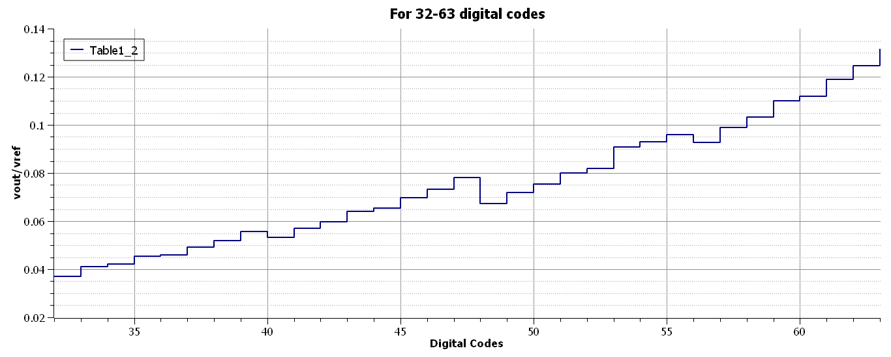

•	Vout/vref vs digital codes for decimal value 512-543

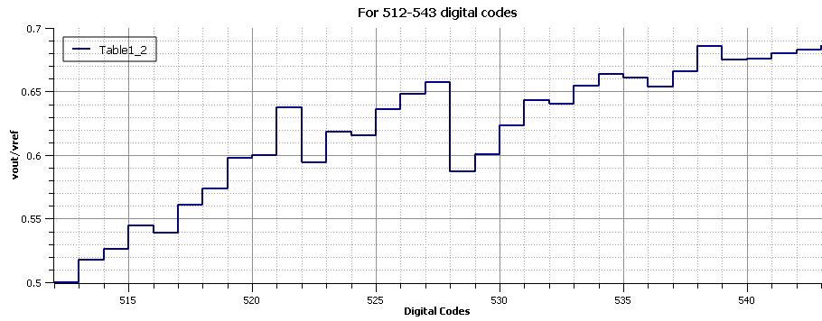

•	Vout/vref vs digital codes for decimal value 960-991

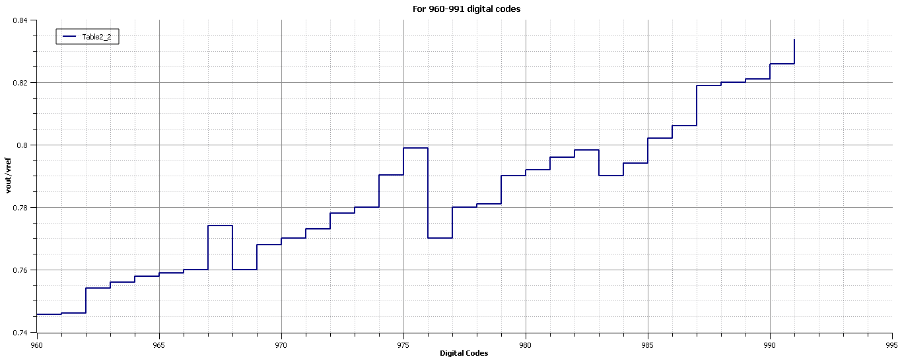

**Diffrential non–linearity(DNL) Graphs**

•	DNL vs digital codes for decimal value 32-63

withlsb.png)

•	DNL vs digital codes for decimal value 512-543

dnlwithlsb.png)

•	DNL vs digital codes for decimal value 960-991

DNLwithlsb.png)

**Integral non-linearity(INL) Graphs**

•	INL vs digital codes for decimal value 32-63

inl.png)

•	INL vs digital codes for decimal value 512-543

inl.png)

•	INL vs digital codes for decimal value 960-991

.png)

 

**Contact Information**

Neelam B. Chaurasiya,BE-Degree, VESIT Mumbai, chaurasiyaneelam001@gmail.com

Bellana Avinash Naidu B.tech, Electronics and Instrumentation, NIT Rourkela avinashbellana@gmail.com

KUNAL GHOSH, Director, VSD Corp. Pvt. Ltd. kunalpghosh@gmail.com

PHILIPP GÜHRING, Software Architect at LibreSilicon Association pg@futureware.at

Dr. GAURAV TRIVEDI, Co-Principal Investigator, EICT Academy, IIT Guwahati trivedi@iitg.ac.in
